# Laporan Pengumpulan — Sistem Royal Hall Booking

---

## Biodata

- Nama: Eagan Ferdian
- NIM : 10241025
- Kelas : A

### 1. Implementasi Daftar dengan Pencarian, Pengurutan, dan Pagination Server-side

Sistem booking ruangan mengimplementasikan halaman daftar dengan fitur yang diminta pada entitas utama Booking (pemesanan ruangan):

#### a. Pencarian Sederhana

- Implementasi di `app/controllers/BookingController.php` dan `app/models/Booking.php`
- Pencarian menggunakan parameter `q` yang mencari pada kolom:
  - Tujuan booking (`purpose`)
  - Nama ruangan (`room_name`)
- Contoh URL: `/bookings?q=meeting`
  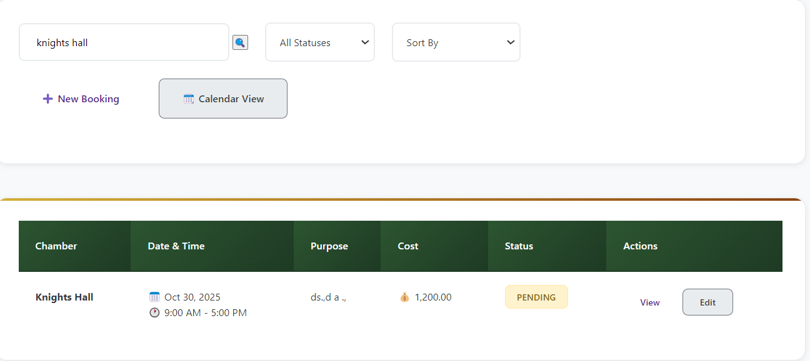
  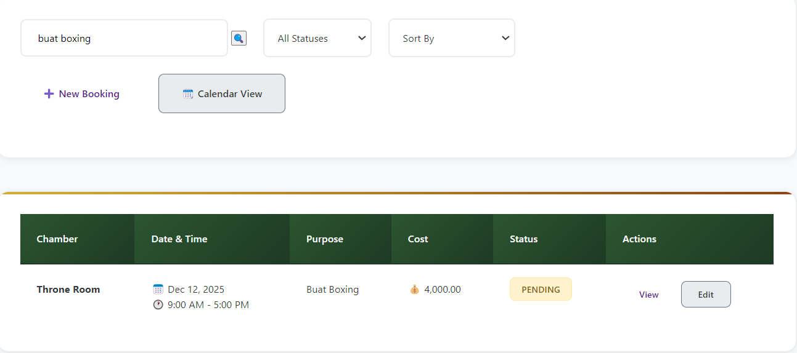

#### b. Pengurutan Kolom

- Implementasi pengurutan server-side di `app/models/Booking.php`
- Mendukung pengurutan berdasarkan:
  - Tanggal booking (asc/desc)
  - Total biaya (asc/desc)
- Contoh URL: `/bookings?sort=date_desc`
  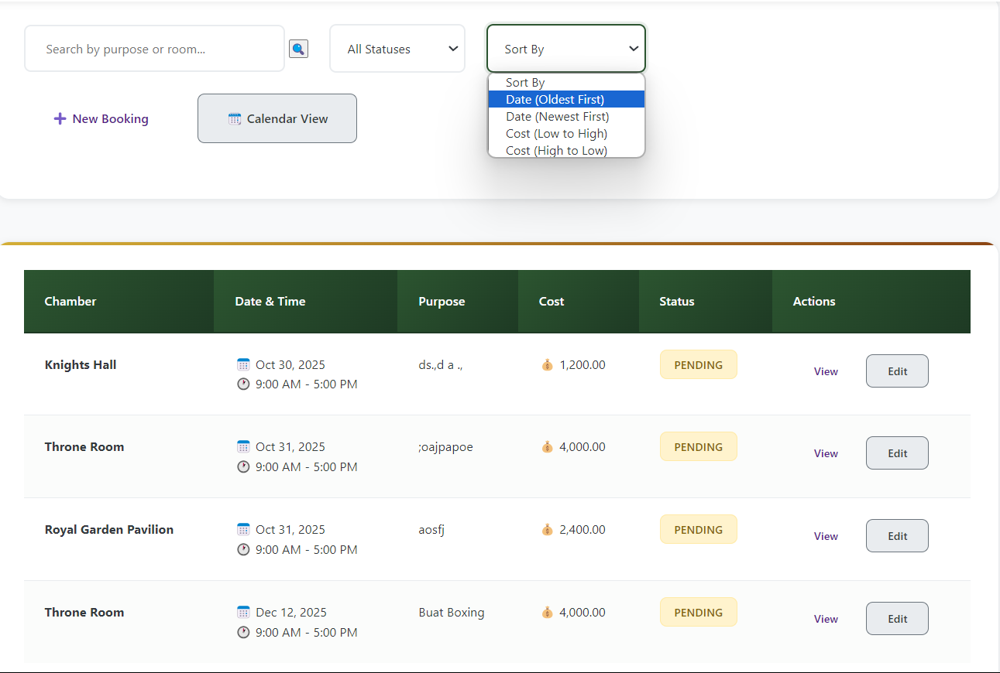
  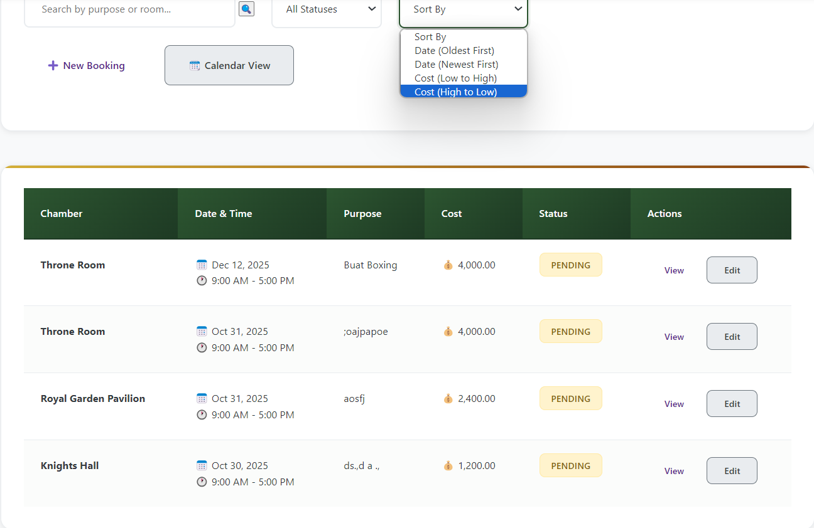

#### c. Pagination Server-side

- Implementasi di `BookingController::index()` menggunakan LIMIT/OFFSET
- Jumlah per halaman: 10 item
- Total halaman dihitung berdasarkan hasil filter
- Contoh URL: `/bookings?page=2`
  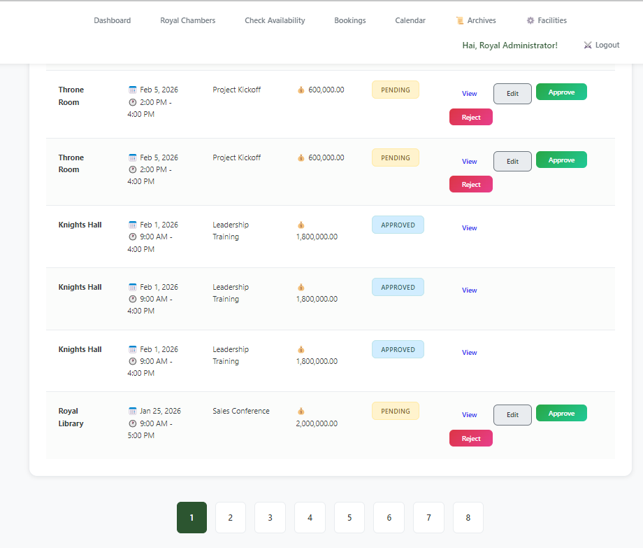

### 2. Validasi Server-side pada Form

Implementasi validasi server-side pada form tambah/edit booking:

#### Field yang Divalidasi:

1. **Tujuan Booking (Wajib)**

   - Validasi di `BookingController::create()`
   - Tidak boleh kosong
   - Maksimal 255 karakter
     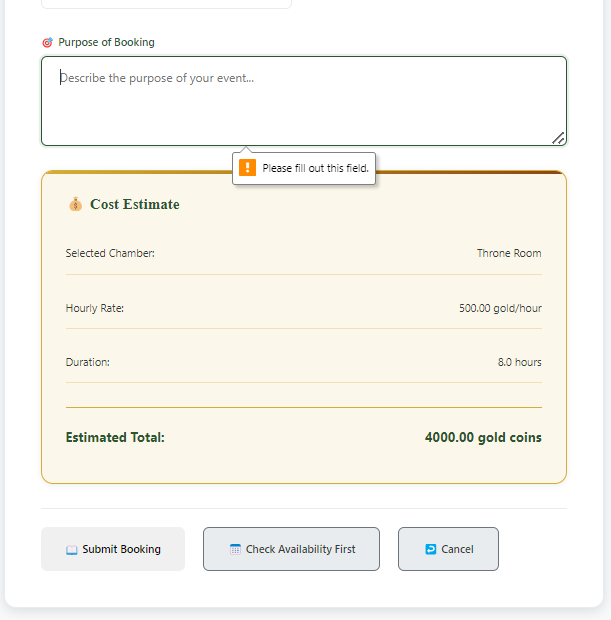

2. **Tanggal & Waktu (Format)**

   - Validasi format tanggal: YYYY-MM-DD
   - Validasi waktu: HH:mm format 24 jam
   - Implementasi di `Booking::validate()`
     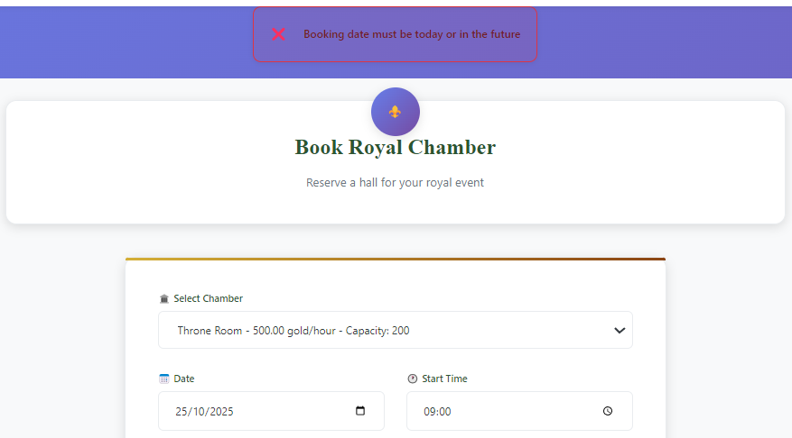

3. **Email/Phone (Unik)**
   - Validasi email unik per user
   - Format email harus valid
   - Implementasi di `app/models/User.php`
     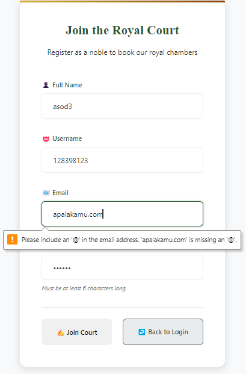

### 3. Soft Delete dan Restore

#### Implementasi Soft Delete:

- Kolom `deleted_at` di tabel `bookings`
- Saat hapus: Update `deleted_at` dengan timestamp
- Data terhapus tidak muncul di daftar utama
- File: `app/models/Booking.php`
  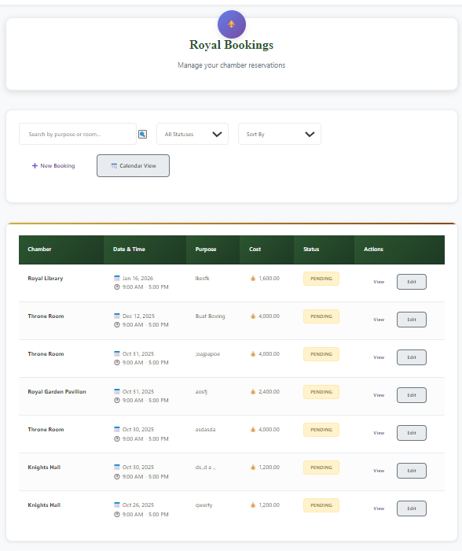
  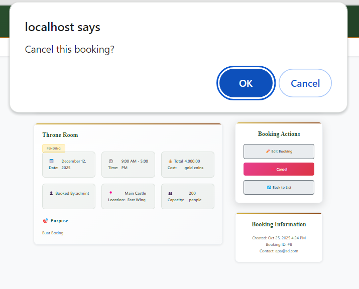
  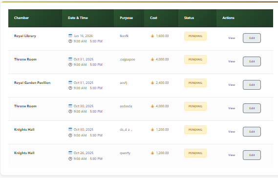
  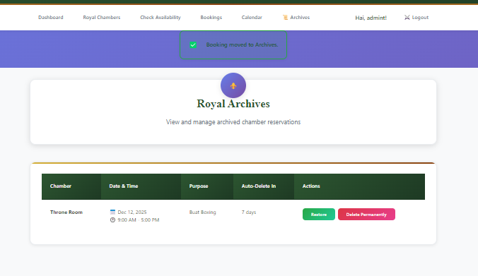

#### Fitur Restore:

- Halaman "Recycle Bin" di `/bookings/trash`
- Tombol restore per item
- Mengembalikan data dengan mengosongkan `deleted_at`
- File: `app/views/bookings/trash.php`
  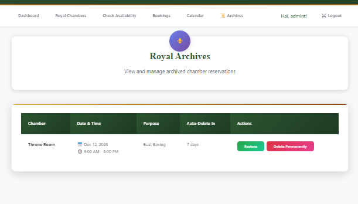

### 4. Modul Relasi: Fasilitas Tambahan

Implementasi relasi booking dengan fasilitas tambahan:

- Tabel: `booking_facilities` (many-to-many)
- Foreign key: `booking_id` ke `bookings`
- Mendukung CRUD fasilitas per booking
- Integritas referensial terjaga dengan foreign key
  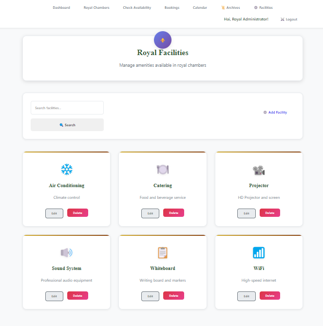
